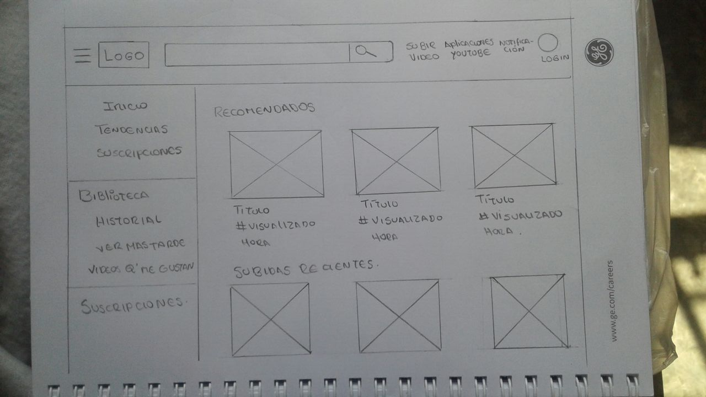
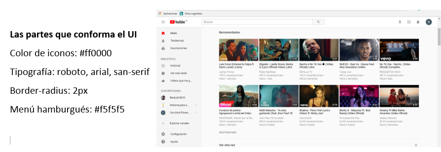

## 1. Elige una web de tu preferencia y explica qué partes conforman el UX y qué partes el UI
+ Pinterest
+ Youtube
+ Laboratoria

### YOUTUBE
Identififcando las partes que realiza UX y un UI

+ UX
Aparte de ser sociable, hacer entrevista a un usuario, tener en cuentas las necesidades y deseos del usuario y para que los usuarios esten felices con los productos tmb se realiza un sketch donde nos permite expresar  y materializar las ideas.

+ UI
Navegación, subnavegación, menús, desplegables, botones, enlaces / ligas / links, ventanas, esquinas redondeadas, sombreado, mensajes de error, alertas, actualizaciones, checkboxes, campos de contraseña, campos de búsqueda, entradas de texto, selectores de radio, áreas de texto, estados de hover, estados de selección, estados presionados, información sobre herramientas, anuncios de banner, videos incrustados, animaciones de desplazamiento, desplazamiento, clics, iconografía, colores, listas, presentaciones de diapositivas, texto alternativo, insignias, notificaciones, degradados, ventanas emergentes, carruseles, OK / Cancelar, etc., etc., etc.

